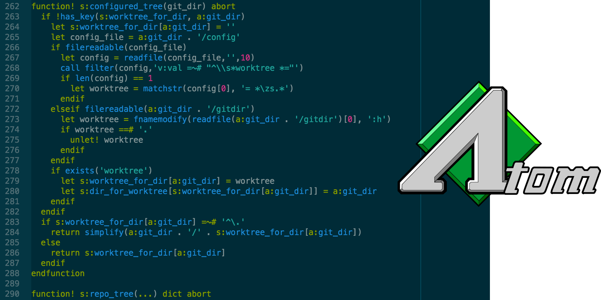

<!-- vim: set noet ts=4 sts=0 tw=0: -->

Vim script highlighting for Atom and GitHub
===========================================

Originally [ported][1] from a [VimL highlighting bundle for TextMate][2], though
very little of the original code still remains.

Usage on GitHub
--------------------------------------------------------------------------------
This repository is used by [GitHub Linguist][3] to power Vim script highlighting
across the site:

~~~VimL
" ~/.vimrc
set encoding=utf-8
filetype on
syntax enable
highlight OverLength ctermbg=red ctermfg=white guibg=#592929

if b:current_syntax =~ "gitcommit"
	match OverLength /\%>72v.\+/
else
	match NONE
endif
~~~

The grammar still has a few rough edges, which I'm working on smoothing out when
I find them. If you've noticed something flaky-looking, *please* [open an issue]
with a sample of the affected code. Seriously.

My editors of choice are [Atom][5] and [Emacs][6], so my knowledge of Vim script
is rudimentary at best. Chances are you know more about this language than I do.

[Referenced links]: ____________________________________________________________
[1]: http://atom.io/docs/v0.60.0/converting-a-text-mate-bundle
[2]: https://github.com/skammer/textmate-viml
[3]: https://github.com/github/linguist/blob/master/vendor/README.md
[4]: https://github.com/Alhadis/language-viml/issues/new
[5]: http://atom.io/
[6]: http://emacsrocks.com/
